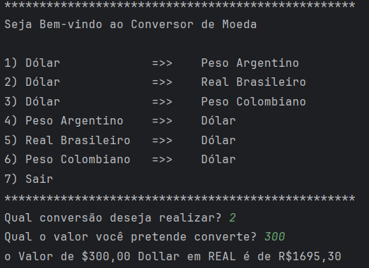

# challenge-conversor-de-moeda-com-API

## API 

A API utilizada para verificar os cotação cambial das moedas é [exchangerate-api](https://www.exchangerate-api.com/) 

## funcionalidade

<ul>
<li>Primeiro você ira escolher o câmbio que deseja realizar, são eles:
    <ol>
        <li>Dólar para Peso Argentino"</li>
        <li>Dólar para Real Brasileiro</li>
        <li>Dólar para Peso Colombiano</li>
        <li>Peso Argentino para Dólar</li>
        <li>Real Brasileiro para Dólar</li>
        <li>Peso Colombiano para Dólar</li>
    </ol>
</li>
<li>Segundo vai escolher o valor da operação</li>
<li>E por fim você ira receber um retorno parecido com esse: <b>"O Valor de $300,00 Dollar em REAL é de R$1695,30"</b></li>
</ul>
Imagem de funcionamento do sistema.
</img>